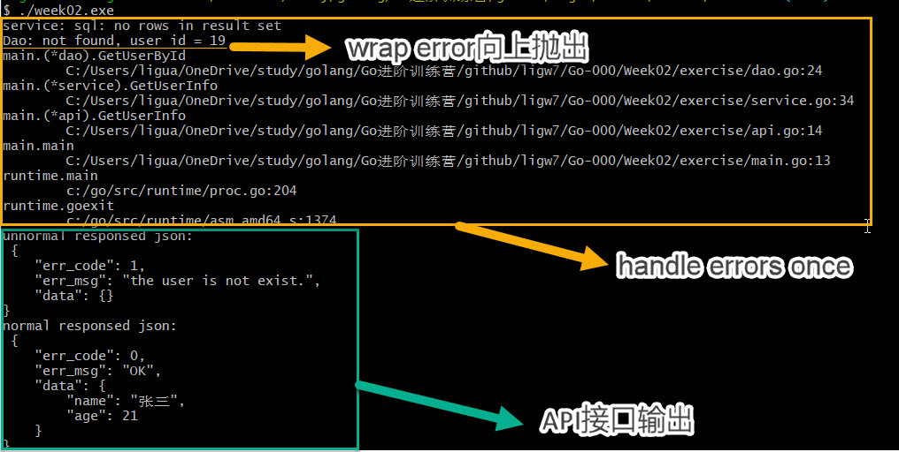

# 作业：

## 我们在数据库操作的时候，比如 dao 层中当遇到一个 sql.ErrNoRows 的时候，是否应该 Wrap 这个 error，抛给上层。为什么，应该怎么做请写出代码？

### 是否应该Wrap这个error，抛给上层？为什么？

答：

- Wrap这个error，抛给上层

- 在调用官方库、基础库、第三方库时，一般是要Wrap error，获取堆栈信息，向上抛出
- 在一个项目（工程）中的代码，处理error时，一般不会Wrap error，直接return error；否则会出现堆栈信息嵌套

### 应该怎么做请写出代码？

答：请参考本目录下的代码实践

### 代码运行结果

```bash
$ ./week02.exe
service: sql: no rows in result set
Dao: not found, user id = 19
main.(*dao).GetUserById
        C:/Users/ligua/OneDrive/study/golang/Go进阶训练营/github/ligw7/Go-000/Week02/exercise/dao.go:24
main.(*service).GetUserInfo
        C:/Users/ligua/OneDrive/study/golang/Go进阶训练营/github/ligw7/Go-000/Week02/exercise/service.go:34
main.(*api).GetUserInfo
        C:/Users/ligua/OneDrive/study/golang/Go进阶训练营/github/ligw7/Go-000/Week02/exercise/api.go:14
main.main
        C:/Users/ligua/OneDrive/study/golang/Go进阶训练营/github/ligw7/Go-000/Week02/exercise/main.go:13
runtime.main
        c:/go/src/runtime/proc.go:204
runtime.goexit
        c:/go/src/runtime/asm_amd64.s:1374
unnormal responsed json:
 {
    "err_code": 1,
    "err_msg": "the user is not exist.",
    "data": {}
}
normal responsed json:
 {
    "err_code": 0,
    "err_msg": "OK",
    "data": {
        "name": "张三",
        "age": 21
    }
}

```

